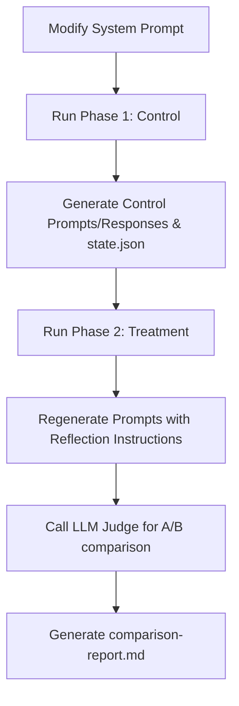

# Prompt A/B Testing & Evaluation Workflow

This document outlines the standard workflow for evaluating system prompt changes using the stateful A/B Prompt Comparison System.

Any AI agent (Claude Code, Antigravity) or human developer proposing changes to WoW Arena Logs' system prompts MUST run this comparison workflow to verify analytical improvements and token efficiency before submitting changes.

> **Scope note:** This harness tests _system prompt text_ changes (`SYSTEM_PROMPT` / `NEW_SYSTEM_PROMPT`). For _prompt-builder code_ changes in the healer pipeline, use `docs/commands/improve-healer-prompts.md` instead; to find what to fix next, use `docs/commands/eval-healer-prompts.md`.

## System Overview

The evaluation system lives in [evalPromptCompare.ts](file:///Users/mingjianliu/code/wowarenalogs/packages/tools/src/evalPromptCompare.ts) and is registered as the npm script `start:evalPromptCompare` in the `@wowarenalogs/tools` package.

Instead of ad-hoc manual inspections, the system uses a **two-phase stateful batch runner** with an automated LLM Judge to produce objective comparison reports.

---

## Anthropic API Key Bypass Option (For All AIs)

For all AI agents (Claude Code, Antigravity, etc.) or human developers, you do not need an Anthropic API key to run evaluations. Instead, you can simply create a new sub-agent and role-play the response AI:

1. Generate the prompt text using the CLI or print tools (e.g., `npm run -w @wowarenalogs/tools start:printMatchPrompts -- --count 1 --new-prompt --test-prompt`).
2. Create a new sub-agent (e.g., via `define_subagent`) and load the system prompts/instructions.
3. Submit the generated match prompts to that sub-agent.
4. Role-play the response AI to generate and verify the output yourself.

## The Workflow Steps



### Phase 1: Control Run

Before making prompt modifications (or using a baseline), compile the "Control" dataset. This builds the match corpus and establishes the reference responses.

```bash
npm run -w @wowarenalogs/tools start:evalPromptCompare -- --phase control --count 10
```

**What it does:**

1. **Corpus Assembly**: Scans cached raw logs in `local-batch/healer-eval/raw-logs/` and `packages/parser/test/testlogs/`. If needed, downloads further matching retail 3v3 match logs from the WoW Arena Logs production API to fill the quota.
2. **State Locking**: Saves the selected match IDs, spec distributions, and metadata to a state file: `local-batch/compare/state.json`.
3. **Control Output Generation**: Builds prompts using the current codebase, calls the baseline system prompt (`SYSTEM_PROMPT` or `NEW_SYSTEM_PROMPT`), and saves:
   - Control prompts: `local-batch/compare/control/prompts/<matchId>.txt`
   - Control responses: `local-batch/compare/control/responses/<matchId>.txt`
   - Token usage: `local-batch/compare/control/tokens.json`

### Phase 2: Treatment Run

After applying your prompt changes (e.g. editing `NEW_SYSTEM_PROMPT` or wrapping context instructions), run the "Treatment" phase.

```bash
npm run -w @wowarenalogs/tools start:evalPromptCompare -- --phase treatment
```

**What it does:**

1. **Corpus Lockout**: Reads `state.json` to ensure the exact same corpus of match IDs and perspectives is evaluated.
2. **Prompt Wrapping & Reflection**: Wraps generated match prompts in XML blocks:
   - `<core_prompt>`: contains the match context.
   - `<meta_eval_instructions>`: requests the model to partition its output into `<core_response>` (the coaching findings) and `<meta_eval_reflection>` (internal reasoning/critique).
3. **Execution**: Sends the wrapped prompt along with the updated system instructions to Claude Sonnet.
4. **LLM Evaluation**: Invokes an independent LLM Judge (`callMetaEvalJudge`) to compare the Control response vs the Core Treatment response (stripped of XML/reflection overhead) across:
   - **Feature Usefulness**: Value of recommendations.
   - **Response Bias**: Objectivity.
   - **Noise/Confusion**: Text clarity.
   - Verdicts: `Version A Winner`, `Version B Winner`, or `Tie`.
5. **Token Normalization**: Calculates raw token counts, subtracting meta-instruction and reflection token overhead to compute the true net change in token consumption.
6. **Report Generation**: Writes the final comparison table and average statistics to:
   - [comparison-report.md](file:///Users/mingjianliu/code/wowarenalogs/packages/tools/local-batch/compare/comparison-report.md)

---

## Script Options

- `--phase <control|treatment>` (Required): Phase selection.
- `--count <N>` (Optional, default `10`): Number of matches to run during control corpus generation.
- `--healer` (Optional): Forces healer perspective logs for the evaluation pool.

---

## Verifying Results

Always check the output markdown report. Judge verdicts are blinded: each judge call shuffles which arm appears as Version A/B (position-bias mitigation) and the stored judgment ends with a canonical `Normalized Verdict` line (`Control Winner` / `Treatment Winner` / `Tie`), which is what the report counts. The proposed system prompt change is considered successful if:

1. **Verdict Win-Rate**: Treatment wins or ties the majority of matches (Normalized Verdict counts).
2. **Token Efficiency**: The net token count (excluding overhead) does not increase dramatically unless offset by significant analytical quality gains.
3. **No regressions**: No typescript compile errors or eslint errors are introduced. Ensure this by running `npm run -w @wowarenalogs/tools lint` after completion.

Also log the run in `docs/eval-ledger.md` (date, commit, change tested, match count, win/tie/loss counts, token delta) — the `local-batch/compare/` outputs are gitignored, so the ledger row is the only durable record.
