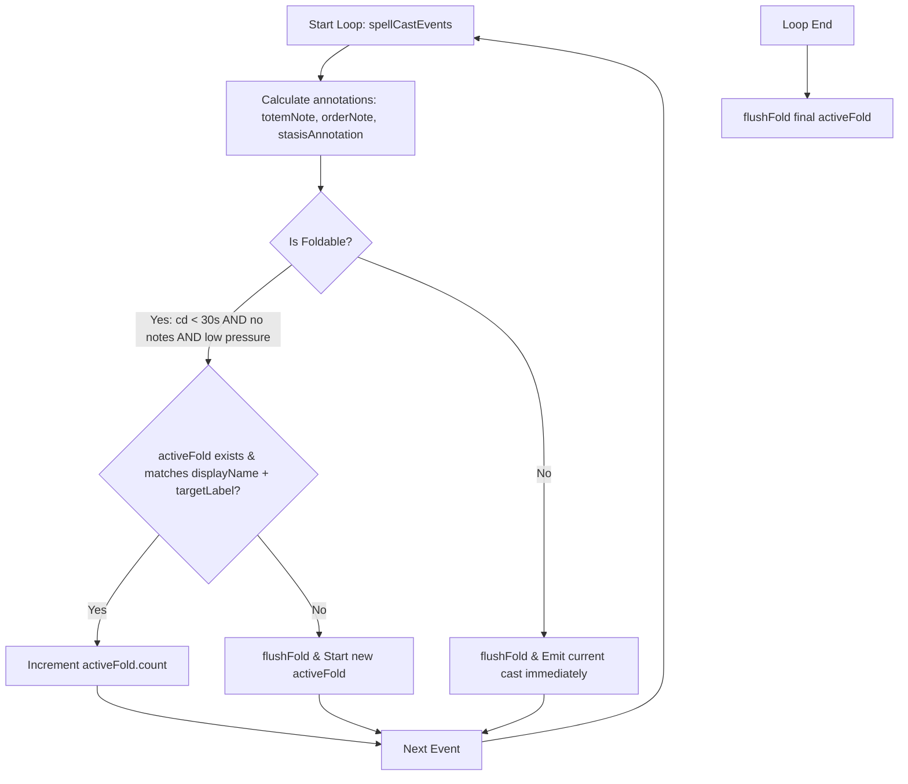

# F151: Repetitive Cast Folding in Match Timeline

This document outlines the design and specification for collapsing consecutive identical casts during low-pressure windows in the match timeline.

## 1. Goal
Reduce token bloat and noise in the timeline sent to the LLM by folding consecutive, identical low-pressure casts (e.g. `Smite`, `Flash Heal`) while retaining full fidelity for critical moments and annotated events.

## 2. Requirements & Constraints
- **Identical Casts**: Consecutive casts are considered identical if they have the same spell name and target.
- **Low-Pressure Windows**: Only fold casts when the second `t` is NOT in `criticalWindowSet` (i.e. not within 10s of a death, 5s of a damage spike, or 10s of a CC land).
- **Simple Casts Only**: Only fold casts that have no annotations or notes (i.e., `totemNote === ''`, `orderNote === ''`, and `stasisAnnotation === ''`). CC casts, major CDs (cooldown $\ge 30\text{s}$), or casts with CC proximity/totem/stasis notes are never folded.
- **Output Format**: Collapsed casts must be formatted as:
  `[SpellName] (x[Count]) → [Target]` (e.g. `0:25  [YOU] [CAST]   Smite (x5) → target`).
  If target is empty, format as:
  `[SpellName] (x[Count])` (e.g. `0:25  [YOU] [CAST]   Tranquility (x5)`).

## 3. Architecture & Data Flow
Instead of post-processing compiled string output, we implement the folding statefully inside the `spellCastEvents` iteration loop in `buildMatchTimeline` ([matchTimeline.ts](file:///Users/mingjianliu/code/wowarenalogs/packages/shared/src/components/CombatReport/CombatAIAnalysis/matchTimeline.ts)).

### Flow Diagram



### State Structure
```typescript
interface IActiveFold {
  displayName: string;
  targetLabel: string;
  startTimeSeconds: number;
  count: number;
}
```

## 4. Test Plan
We will write Jest tests in `timeline.test.ts` to verify:
1. **Consecutive folding in low pressure**: `Flash Heal` cast 3 times in a row at `t=10, 12, 14` outside critical windows should collapse into a single `Flash Heal (x3)` entry at `t=10`.
2. **No folding in critical windows**: If `Flash Heal` is cast consecutively but falls inside a critical window (e.g., target dies at `t=18`, putting `t=10..18` in the critical window), they must be emitted as individual entries.
3. **No folding for CC / CDs / annotated casts**: Spells with cooldown $\ge 30\text{s}$, CC casts, or casts with proximity notes (e.g., `[completed before CC landed]`) are never collapsed.
4. **Target validation**: Consecutive identical spells to *different* targets (e.g., `Flash Heal → PlayerA`, then `Flash Heal → PlayerB`) must not be folded together.
